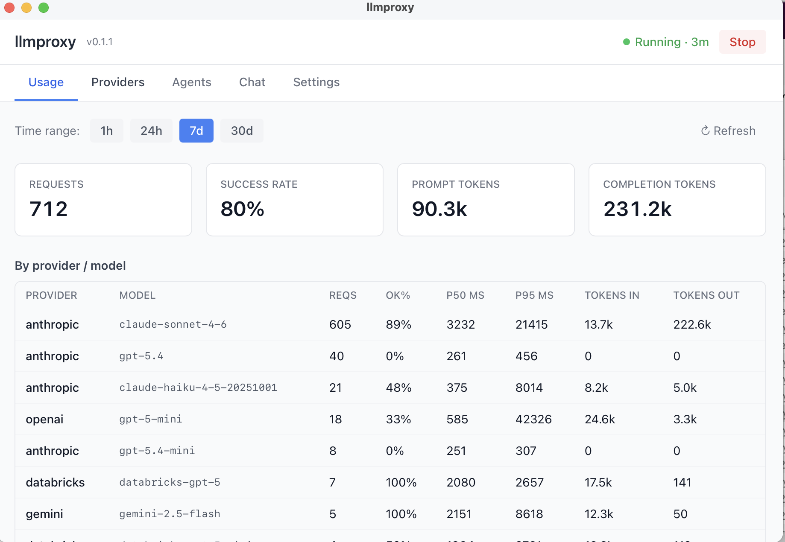
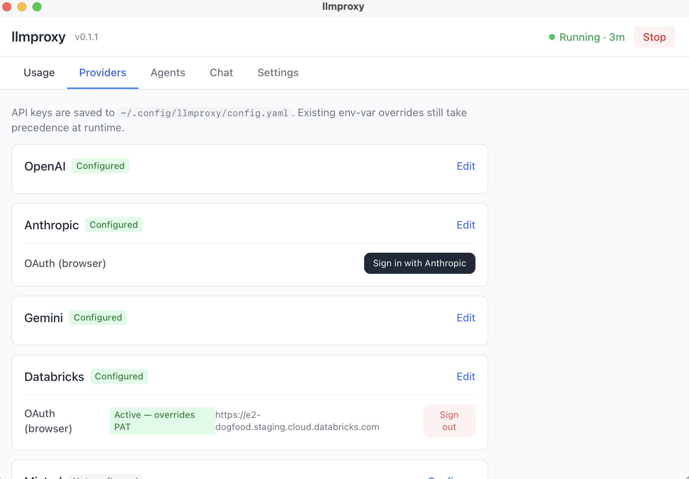
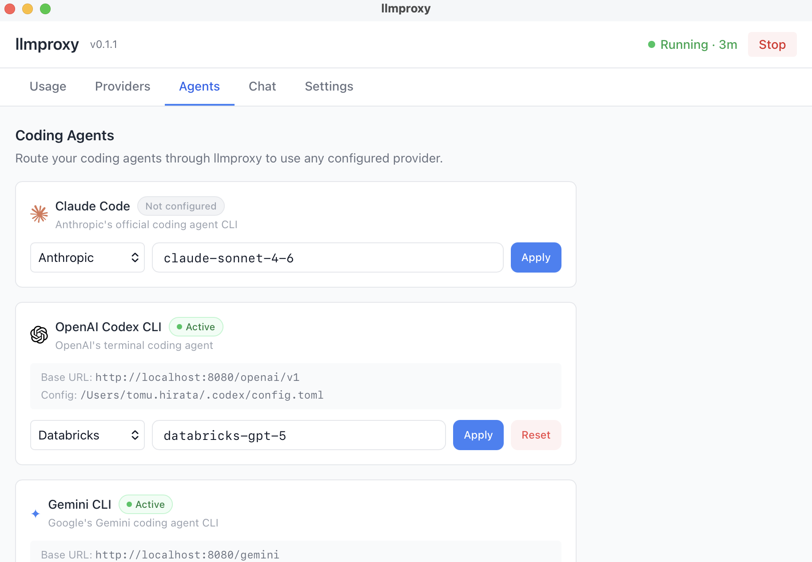
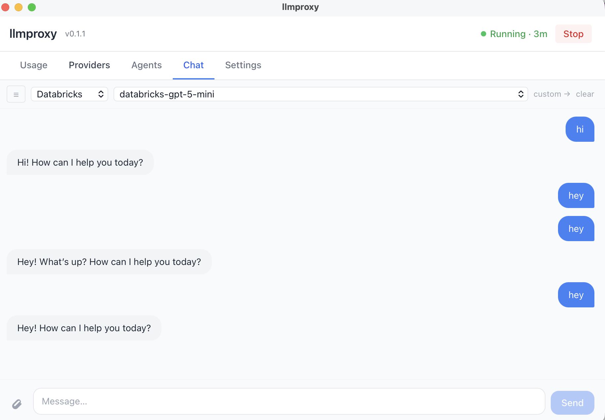

# llmproxy

Localhost LLM proxy — OpenAI-compatible API, no Python required.

Point any OpenAI SDK at `http://localhost:8080/v1` and route to OpenAI,
Anthropic, Gemini, AWS Bedrock, Azure OpenAI, Mistral, TogetherAI, or
Databricks Model Serving by prefixing the model with a provider name:

```python
from openai import OpenAI
client = OpenAI(base_url="http://localhost:8080/v1", api_key="")
client.chat.completions.create(
    model="anthropic/claude-sonnet-4-5",
    messages=[{"role": "user", "content": "hello"}],
)
```

No config file is required. API keys can be read from standard environment
variables (`OPENAI_API_KEY`, `ANTHROPIC_API_KEY`, …) or passed per-request in
the `Authorization: Bearer …` header. A YAML config file (§ Config below) is
supported if you'd rather keep keys out of your shell environment.

## Desktop app

The macOS desktop app lives in your menu bar and gives you a full dashboard
without touching the terminal.

**[Download the latest DMG →](https://github.com/TomeHirata/llm-proxy/releases/latest)**

| | |
|---|---|
|  |  |
| **Usage** — live request stats by provider and model | **Providers** — configure API keys or sign in via OAuth (Anthropic, Databricks) |
|  |  |
| **Agents** — route Claude Code, Codex CLI, and Gemini CLI through any provider | **Chat** — test any provider and model directly from the app |

### Install (DMG)

> **Requires macOS on Apple Silicon (M1 or later).**

1. Download `llmproxy_0.2.0_aarch64.dmg` from the [releases page](https://github.com/TomeHirata/llm-proxy/releases/latest).
2. Open the DMG and drag **llmproxy** to your Applications folder.
3. If macOS shows a security warning on first launch, clear the quarantine flag:
   ```bash
   xattr -dr com.apple.quarantine /Applications/llmproxy.app
   ```
4. Open the app — a menu-bar icon appears. Click it to open the dashboard.

The app starts the proxy daemon automatically on launch and restarts it whenever you change provider credentials. No separate `llmproxy serve` command is needed.

**First-time setup:**
1. Open the dashboard and click **Start** if the proxy isn't running yet.
2. Go to **Providers** and add API keys (or sign in via OAuth for Anthropic or Databricks).
3. Open **Chat** to verify everything works — pick a provider and send a message.
4. Optionally go to **Agents** to route Claude Code, Codex CLI, or Gemini CLI through the proxy.

### Build from source

Requires Node.js 18+ and Rust (install via [rustup](https://rustup.rs)).

```bash
git clone https://github.com/TomeHirata/llm-proxy
cd llm-proxy

# Build the CLI sidecar and the .app bundle
cd app && npm install
CI=true npx tauri build

# Install
cp -r ../target/release/bundle/macos/llmproxy.app /Applications/
xattr -dr com.apple.quarantine /Applications/llmproxy.app
open /Applications/llmproxy.app
```

**Dev mode** (hot-reload):
```bash
cd app
npm run tauri dev
```

## Supported providers

| Provider key   | Transport                                   | Credential source                                   |
|----------------|---------------------------------------------|-----------------------------------------------------|
| `openai`       | passthrough                                 | `OPENAI_API_KEY` / header / config                  |
| `azure`        | passthrough (`api-key` header, per-deploy)  | `endpoint` + `api_version` + key in config          |
| `mistral`      | passthrough                                 | `MISTRAL_API_KEY` / header / config                 |
| `togetherai`   | passthrough                                 | `TOGETHERAI_API_KEY` / header / config              |
| `anthropic`    | translation + SSE                           | `ANTHROPIC_API_KEY` / header / config / OAuth       |
| `gemini`       | translation + SSE                           | `GEMINI_API_KEY` / header / config                  |
| `bedrock`      | Converse API, SigV4-signed                  | `AWS_ACCESS_KEY_ID` + `AWS_SECRET_ACCESS_KEY` + `AWS_REGION` |
| `databricks`   | passthrough                                 | `endpoint` + PAT / OAuth                            |
| `copilot`      | passthrough                                 | GitHub Copilot OAuth                                |
| `codex_oauth`  | passthrough                                 | OpenAI Codex OAuth                                  |

All providers support both non-streaming and streaming (`stream: true`).

## Install (CLI)

### macOS (universal binary — Intel + Apple Silicon)

```bash
curl -L https://github.com/TomeHirata/llm-proxy/releases/latest/download/llmproxy-$(git ls-remote --tags https://github.com/TomeHirata/llm-proxy | awk -F/ '{print $NF}' | grep '^v' | sort -V | tail -1)-universal-apple-darwin.tar.gz \
  | tar -xz
sudo mv llmproxy-*/llmproxy /usr/local/bin/llmproxy
# Clear Gatekeeper quarantine if prompted on first run:
xattr -d com.apple.quarantine /usr/local/bin/llmproxy
```

Or with a pinned version:

```bash
VERSION=v0.1.0
curl -L "https://github.com/TomeHirata/llm-proxy/releases/download/${VERSION}/llmproxy-${VERSION}-universal-apple-darwin.tar.gz" \
  | tar -xz
sudo mv "llmproxy-${VERSION}-universal-apple-darwin/llmproxy" /usr/local/bin/llmproxy
xattr -d com.apple.quarantine /usr/local/bin/llmproxy
```

### Debian / Ubuntu (APT)

```bash
# Add the signing key
curl -fsSL https://tomehirata.github.io/llm-proxy/apt/pubkey.asc \
  | sudo gpg --dearmor -o /etc/apt/keyrings/llmproxy.gpg

# Add the repository (replace <codename> with bookworm / trixie / jammy / noble)
echo "deb [signed-by=/etc/apt/keyrings/llmproxy.gpg] \
  https://tomehirata.github.io/llm-proxy/apt <codename> main" \
  | sudo tee /etc/apt/sources.list.d/llmproxy.list

sudo apt-get update
sudo apt-get install llmproxy
```

### Linux (binary tarball)

```bash
VERSION=v0.1.0
# For x86_64:
curl -L "https://github.com/TomeHirata/llm-proxy/releases/download/${VERSION}/llmproxy-${VERSION}-x86_64-unknown-linux-gnu.tar.gz" \
  | tar -xz
sudo mv "llmproxy-${VERSION}-x86_64-unknown-linux-gnu/llmproxy" /usr/local/bin/llmproxy
# For arm64: replace x86_64-unknown-linux-gnu with aarch64-unknown-linux-gnu
```

### From source (CLI only)

```bash
cargo build --release -p llmproxy-server
./target/release/llmproxy serve
```

## Usage

```bash
llmproxy serve                 # foreground, default 127.0.0.1:8080
llmproxy serve --port 9000     # custom port
llmproxy serve --daemon        # fork, write PID to ~/.local/share/llmproxy/llmproxy.pid
llmproxy stop                  # SIGTERM the daemon
llmproxy status                # is the daemon alive?
llmproxy providers             # show which providers have credentials
llmproxy test anthropic        # send a hello ping to a provider
llmproxy install               # register launchd agent (macOS) or systemd user unit (Linux)
llmproxy uninstall             # remove the autostart service
llmproxy config init           # scaffold ~/.config/llmproxy/config.yaml
llmproxy config show           # print resolved config with secrets redacted
llmproxy usage summary         # aggregate stats from the persistent log
llmproxy usage recent          # most recent log entries
llmproxy usage prune           # one-shot retention cleanup
```

### Usage log

Enabled by default. Every request is persisted — provider, model, status,
latency, token counts, and truncated request/response bodies — into a local
SQLite database at `~/.local/share/llmproxy/usage.sqlite`. The `Authorization`
header is never recorded. Rows older than `retention_days` (default 30) are
pruned hourly.

```bash
llmproxy usage summary --since 7d
llmproxy usage recent --limit 50 --verbose
```

To disable, set `usage_log.enabled: false` in config:

```yaml
usage_log:
  enabled: false
```

### Routing

Every request's `model` field is parsed as `provider/model_id` on the first
`/`. Model IDs containing slashes — e.g. Bedrock cross-region ARNs like
`us.anthropic.claude-3-5-sonnet-20241022-v2:0` — are preserved verbatim.

| `model` field                           | Provider    | Upstream model id                   |
|-----------------------------------------|-------------|-------------------------------------|
| `openai/gpt-4o`                         | OpenAI      | `gpt-4o`                            |
| `anthropic/claude-sonnet-4-5`           | Anthropic   | `claude-sonnet-4-5`                 |
| `gemini/gemini-2.5-flash`               | Gemini      | `gemini-2.5-flash`                  |
| `bedrock/amazon.nova-pro-v1:0`          | Bedrock     | `amazon.nova-pro-v1:0`              |
| `azure/my-gpt4-deployment`              | Azure       | `my-gpt4-deployment` (deployment)   |
| `mistral/mistral-large-latest`          | Mistral     | `mistral-large-latest`              |
| `databricks/databricks-gpt-5`          | Databricks  | `databricks-gpt-5`                  |

### Credential resolution

Per-request, highest priority first:

1. `Authorization: Bearer <token>` header (not applicable to Bedrock)
2. `providers.<name>.api_key` from the config file
3. Well-known environment variable: `OPENAI_API_KEY`, `ANTHROPIC_API_KEY`,
   `GEMINI_API_KEY`, `MISTRAL_API_KEY`, `TOGETHERAI_API_KEY`,
   `AZURE_OPENAI_API_KEY`, or AWS credentials for Bedrock

If none resolve, the proxy returns `401 Unauthorized`.

## Config

The config file is entirely optional. Search order (first hit wins):

1. `--config <path>` CLI flag
2. `$LLMPROXY_CONFIG` env var
3. `~/.config/llmproxy/config.yaml`
4. `./llmproxy.yaml`

`${ENV_VAR}` interpolation is supported in YAML values.

```yaml
server:
  host: 127.0.0.1
  port: 8080

providers:
  openai:
    api_key: ${OPENAI_API_KEY}
  anthropic:
    api_key: ${ANTHROPIC_API_KEY}
  gemini:
    api_key: ${GEMINI_API_KEY}
  mistral:
    api_key: ${MISTRAL_API_KEY}
  bedrock:
    region: us-east-1
  azure:
    api_key: ${AZURE_OPENAI_API_KEY}
    endpoint: https://my-resource.openai.azure.com
    api_version: "2024-02-01"
  databricks:
    endpoint: https://my-workspace.azuredatabricks.net
    api_key: ${DATABRICKS_TOKEN}
```

See `config.example.yaml` for the full schema.

## Recipes

### Claude Code

Route Claude Code through the proxy to use any provider and track usage:

```bash
llmproxy serve --daemon
export ANTHROPIC_BASE_URL="http://localhost:8080/anthropic"
claude
```

Or use the **Agents tab** in the desktop app to configure this with one click.

### OpenAI Codex CLI

```bash
export OPENAI_BASE_URL="http://localhost:8080/openai/v1"
codex
```

### Gemini CLI

```bash
export GOOGLE_GEMINI_BASE_URL="http://localhost:8080/gemini"
gemini
```

### Cursor / VS Code Copilot

```bash
export OPENAI_BASE_URL="http://localhost:8080/openai/v1"
```

## Endpoints

| Method | Path                                            | Notes                                          |
|--------|-------------------------------------------------|------------------------------------------------|
| POST   | `/v1/chat/completions`                          | Unified OpenAI shape; `stream: true` uses SSE  |
| GET    | `/v1/models`                                    | Lists configured provider keys                 |
| GET    | `/health`                                       | Returns `ok`                                   |
| POST   | `/openai/v1/responses`                          | OpenAI Responses API passthrough               |
| POST   | `/anthropic/v1/messages`                        | Anthropic Messages API passthrough             |
| POST   | `/gemini/v1beta/models/:model/generateContent`  | Gemini generateContent passthrough             |

## Project layout

```
app/                         # Tauri desktop app (React + Rust)
crates/
├── llmproxy-core/           # OpenAI types, Provider trait, Credential, errors
├── llmproxy-providers/      # Passthrough, Anthropic, Gemini, Bedrock implementations
└── llmproxy-server/         # Axum server, config, registry, CLI
```

Dependency direction: `server → providers → core`.

## Development

```bash
cargo test                          # unit tests
cargo clippy --all-targets -- -D warnings
cargo fmt --all -- --check
cargo build --release -p llmproxy-server
```

